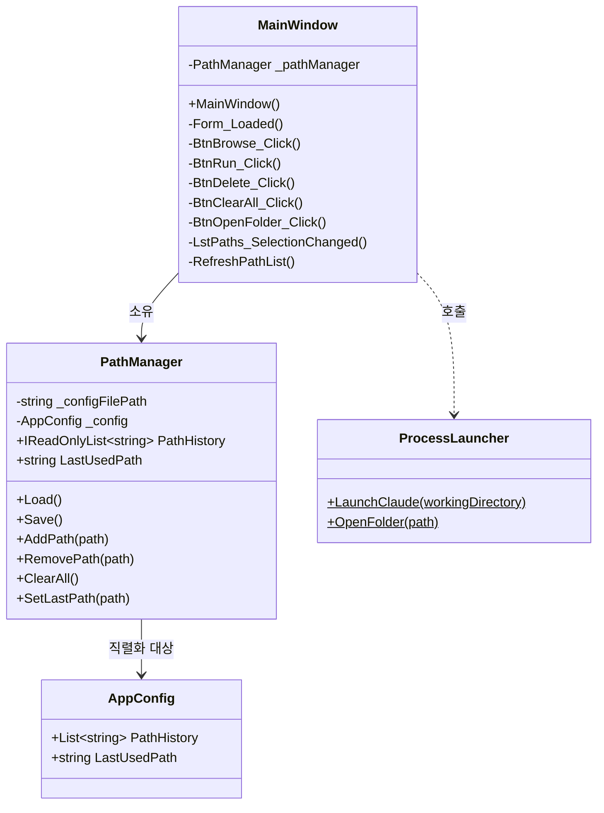
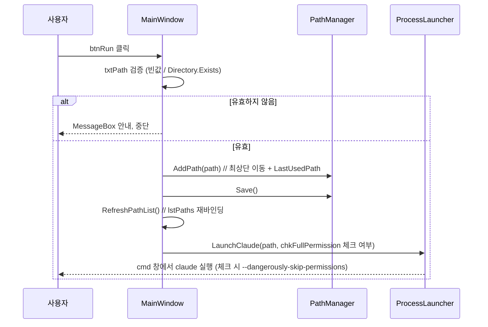
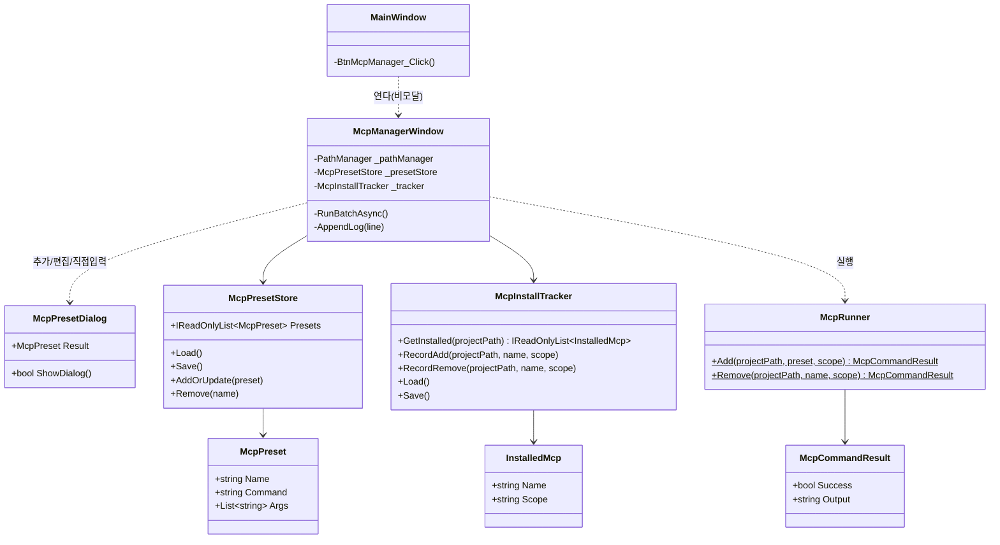
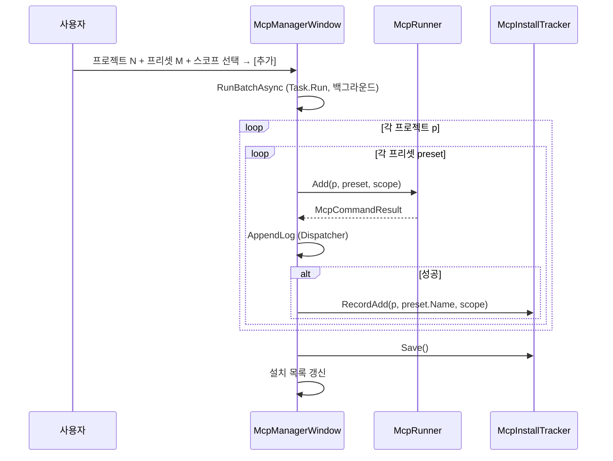
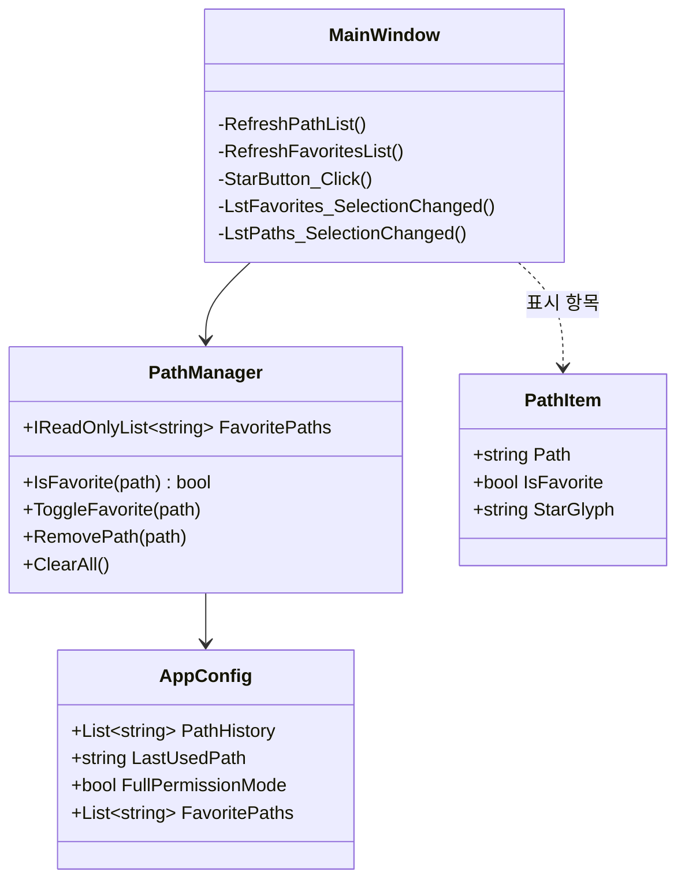
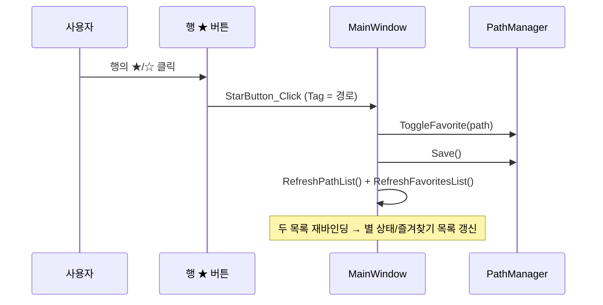

# ClaudeCodeHelper 설계서

## 개요
- **목적**: 프로젝트 폴더를 등록·선택해 해당 폴더에서 `claude` CLI를 실행하는 WPF 런처.
- **참조**: `Docs/DEVELOPMENT/Dev/Launcher/LAUNCHER_SPEC.md`
- **범위**: MainWindow XAML 레이아웃 + code-behind 이벤트 핸들러 + `PathManager` / `ProcessLauncher` / `AppConfig` 인터페이스.
- **벗어나는 범위**: MVVM/바인딩 추상화(1:1 복원이라 code-behind 직접 조작), 멀티 플랫폼.

## 제약 / 가정
- **제약**: Windows 전용(`net8.0-windows`, WPF). `System.Text.Json` 사용. 실행은 `cmd /k claude` 고정.
- **가정**: `claude`가 PATH에 등록돼 있어 `cmd`에서 호출 가능. config 파일은 실행 파일과 같은 폴더에 둔다.

## 아키텍처



**계층 책임**

| 타입 | 책임 |
|------|------|
| `MainWindow` | UI 표시 + 이벤트 핸들링. 검증 메시지(`MessageBox`)와 `lstPaths` 갱신 담당. |
| `PathManager` | config I/O + 경로 히스토리 상태(추가/삭제/최상단 이동/LastUsedPath). |
| `ProcessLauncher` | 외부 프로세스 실행만 (`cmd /k claude`, `explorer`). 정적 유틸. |
| `AppConfig` | JSON 직렬화 모델 (POCO). |

## XAML 레이아웃

```
┌─────────────────────────────────────────────────────┐
│ 경로: [txtPath............................] [찾아보기][실행] │  ← Row0 (Auto)
│ 저장된 경로 목록:                                       │  ← Row1 (Auto)
│ ┌───────────────────────────────┐ ┌──────────┐       │
│ │ lstPaths                       │ │ [삭제]    │       │  ← Row2 (*)
│ │  D:\GitPrjs\ClaudeCodeHelper   │ │ [전체삭제] │       │
│ │  D:\ClaudeEtc                  │ │ [폴더열기] │       │
│ │  ...                           │ │          │       │
│ └───────────────────────────────┘ └──────────┘       │
└─────────────────────────────────────────────────────┘
```

구조: 루트 `Grid`(3 Row) → Row0은 내부 `Grid`(Label / TextBox `*` / Browse / Run), Row2는 내부 `Grid`(2 Column: ListBox `*` / 버튼 `StackPanel`).

```xml
<Grid Margin="10">
    <Grid.RowDefinitions>
        <RowDefinition Height="Auto"/>   <!-- 경로 입력줄 -->
        <RowDefinition Height="Auto"/>   <!-- 목록 라벨 -->
        <RowDefinition Height="*"/>      <!-- 목록 + 버튼 -->
    </Grid.RowDefinitions>

    <!-- Row0: 경로 입력 -->
    <Grid Grid.Row="0">
        <Grid.ColumnDefinitions>
            <ColumnDefinition Width="Auto"/>
            <ColumnDefinition Width="*"/>
            <ColumnDefinition Width="Auto"/>
            <ColumnDefinition Width="Auto"/>
        </Grid.ColumnDefinitions>
        <TextBlock Grid.Column="0" Text="경로:" VerticalAlignment="Center" Margin="0,0,6,0"/>
        <TextBox   Grid.Column="1" x:Name="txtPath"/>
        <Button    Grid.Column="2" x:Name="btnBrowse" Content="찾아보기" Click="BtnBrowse_Click" Margin="6,0,0,0"/>
        <Button    Grid.Column="3" x:Name="btnRun"    Content="실행"     Click="BtnRun_Click"    Margin="6,0,0,0"/>
    </Grid>

    <!-- Row1: 라벨 -->
    <TextBlock Grid.Row="1" Text="저장된 경로 목록:" Margin="0,10,0,4"/>

    <!-- Row2: 목록 + 버튼 -->
    <Grid Grid.Row="2">
        <Grid.ColumnDefinitions>
            <ColumnDefinition Width="*"/>
            <ColumnDefinition Width="Auto"/>
        </Grid.ColumnDefinitions>
        <ListBox Grid.Column="0" x:Name="lstPaths" SelectionChanged="LstPaths_SelectionChanged"/>
        <StackPanel Grid.Column="1" Margin="6,0,0,0">
            <Button x:Name="btnDelete"   Content="삭제"     Click="BtnDelete_Click"   Margin="0,0,0,6"/>
            <Button x:Name="btnClearAll" Content="전체 삭제" Click="BtnClearAll_Click" Margin="0,0,0,6"/>
            <Button x:Name="btnOpenFolder" Content="폴더 열기" Click="BtnOpenFolder_Click"/>
        </StackPanel>
    </Grid>
</Grid>
```

> 원본은 WinForms `FolderBrowserDialog`였음. WPF에는 기본 폴더 다이얼로그가 없어 **.NET 8 내장 `Microsoft.Win32.OpenFolderDialog`** 사용(.NET 8부터 지원, 추가 패키지 불필요).

## 인터페이스 (구현 본문 없음)

```csharp
/// <summary>
/// config 파일(ClaudeCodeHelper.json)의 직렬화 모델.
/// </summary>
public class AppConfig
{
    /// <summary>등록된 경로 목록(최신이 앞).</summary>
    public List<string> PathHistory { get; set; } = new();

    /// <summary>마지막으로 실행한 경로.</summary>
    public string LastUsedPath { get; set; } = "";

    /// <summary>모든 권한으로 실행 여부(전역 토글).</summary>
    public bool FullPermissionMode { get; set; } = false;
}
```

```csharp
/// <summary>
/// 경로 히스토리 로드/저장 및 추가·삭제를 관리한다.
/// </summary>
public class PathManager
{
    /// <summary>config 파일 경로를 지정해 생성한다.</summary>
    /// <param name="configFilePath">ClaudeCodeHelper.json의 전체 경로</param>
    public PathManager(string configFilePath);

    /// <summary>현재 경로 목록(읽기 전용).</summary>
    public IReadOnlyList<string> PathHistory { get; }

    /// <summary>마지막 사용 경로.</summary>
    public string LastUsedPath { get; }

    /// <summary>모든 권한으로 실행 여부(전역 토글).</summary>
    public bool FullPermissionMode { get; set; }

    /// <summary>config 파일을 읽어 상태를 채운다. 파일 부재/손상 시 빈 상태로 시작.</summary>
    public void Load();

    /// <summary>현재 상태를 config 파일에 저장한다.</summary>
    public void Save();

    /// <summary>경로를 목록 최상단에 추가(중복이면 위로 이동)하고 LastUsedPath로 설정한다.</summary>
    /// <param name="path">추가할 경로</param>
    public void AddPath(string path);

    /// <summary>지정 경로를 목록에서 제거한다.</summary>
    /// <param name="path">제거할 경로</param>
    public void RemovePath(string path);

    /// <summary>모든 경로를 제거한다.</summary>
    public void ClearAll();

    /// <summary>마지막 사용 경로를 설정한다.</summary>
    /// <param name="path">설정할 경로</param>
    public void SetLastPath(string path);
}
```

```csharp
/// <summary>
/// 외부 프로세스 실행 유틸리티.
/// </summary>
public static class ProcessLauncher
{
    /// <summary>지정 폴더에서 cmd.exe로 claude CLI를 실행한다(/k로 창 유지).</summary>
    /// <param name="workingDirectory">작업 디렉터리</param>
    /// <param name="fullPermission">true면 --dangerously-skip-permissions 플래그로 모든 권한 부여</param>
    public static void LaunchClaude(string workingDirectory, bool fullPermission);

    /// <summary>탐색기로 지정 폴더를 연다.</summary>
    /// <param name="path">열 폴더 경로</param>
    public static void OpenFolder(string path);
}
```

- **config 경로 결정**: `Path.Combine(AppContext.BaseDirectory, "ClaudeCodeHelper.json")`.
- **`LaunchClaude` 핵심**: `ProcessStartInfo { FileName="cmd.exe", Arguments=fullPermission ? "/k claude --dangerously-skip-permissions" : "/k claude", WorkingDirectory=workingDirectory, UseShellExecute=true }` → `Process.Start`.
- **전역 권한 토글**: `chkFullPermission`(CheckBox) 상태를 `MainWindow` 생성자에서 `FullPermissionMode`로 복원(초기화 가드로 startup 저장 방지), `ChkFullPermission_Changed`에서 변경 시 `Save`. 실행 시 체크 상태를 `LaunchClaude`에 전달.

## 주요 흐름 — "실행" 클릭



기타 핸들러 요약:
- **BtnBrowse**: `OpenFolderDialog` → 선택 시 `txtPath`에 반영.
- **ChkFullPermission_Changed**: 체크 변경 시 `FullPermissionMode` 갱신 + `Save` (초기화 가드 적용).
- **LstPaths_SelectionChanged**: 선택 항목 → `txtPath`에 반영.
- **BtnDelete**: 선택 없으면 안내 / 확인 후 `RemovePath` → `Save` → `RefreshPathList`.
- **BtnClearAll**: 확인 후 `ClearAll` → `Save` → `RefreshPathList`.
- **BtnOpenFolder**: 선택/입력 경로 검증 후 `OpenFolder`.

## 의존성
- **외부**: `System.Text.Json`(직렬화), `Microsoft.Win32.OpenFolderDialog`(폴더 선택) — 둘 다 .NET 8 기본 제공, NuGet 불필요.
- **내부**: `MainWindow` → `PathManager`, `ProcessLauncher`, `AppConfig`.

## 요구사항 충족 검증
> design 작성 시점 self-validation 마킹.
- [x] FR-1 경로 입력/선택 — `txtPath` + `BtnBrowse_Click`(OpenFolderDialog)
- [x] FR-2 Claude 실행 — `BtnRun_Click` → 검증 → `AddPath`/`Save` → `LaunchClaude`(cmd /k claude)
- [x] FR-3 목록 관리 — `lstPaths` + Delete/ClearAll/OpenFolder 핸들러
- [x] FR-4 설정 영속화 — `AppConfig`(+ `FullPermissionMode`) + `PathManager.Load/Save` + `System.Text.Json`, 빈 목록 시작
- [x] FR-5 모든 권한으로 실행 — `chkFullPermission`(전역 토글) → `LaunchClaude(path, fullPermission)`, 상태 `FullPermissionMode`로 영속화
- [x] 비기능: 계층 분리(PathManager/ProcessLauncher), config 손상 시 빈 상태 시작(`Load` try/catch)

## MCP 관리 (FR-6) 설계

선택한 여러 프로젝트에 로컬/프로젝트 스코프 MCP를 프리셋/직접입력으로 일괄 추가·제거하는 **별도 창** 서브시스템.

### 제약 / 가정 (MCP)
- MCP 등록은 `claude mcp add/remove` CLI로만(직접 JSON 금지 — 사용자 룰). 제거는 항상 `-s <scope>` 명시 → 글로벌 보호.
- Windows에서 `claude`는 셸 스크립트(.cmd) 가능성 → **`cmd.exe /c claude ...`** 로 실행.
- 결과 로그를 위해 `UseShellExecute=false` + 표준출력/에러 리다이렉트(기존 `LaunchClaude`의 `UseShellExecute=true`와 분리).

### 아키텍처 (MCP)



| 타입 | 책임 |
|------|------|
| `McpPreset` / `McpPresetStore` | 프리셋 데이터 + CRUD (`mcp_presets.json`) |
| `InstalledMcp` / `McpInstallTracker` | 프로젝트별 설치 기록 (`mcp_installed.json`) |
| `McpRunner` | `cmd /c claude mcp add/remove` 실행 + stdout/stderr 캡처 (정적) |
| `McpManagerWindow` | UI + 다중선택 + 배치 실행 + 로그 |
| `McpPresetDialog` | 프리셋 입력 모달(추가/편집/직접입력 공용) |
| `MainWindow` | "MCP 관리" 버튼으로 창 오픈(PathManager 전달) |

### XAML 레이아웃 (McpManagerWindow)

```
프로젝트(다중선택, PathHistory 재사용) | 프리셋(다중선택) [추가][편집][삭제][직접입력]
스코프: (●)local ( )project
[선택 프로젝트에 추가]   [선택 항목 제거]
── 설치된 MCP(선택 프로젝트 기준) ──   [새로고침]
── 실행 로그(읽기 전용) ──
```
- 프로젝트/프리셋 `ListBox`는 `SelectionMode="Extended"`(문자열 리스트 유지, 템플릿 변경 불필요).

### 인터페이스 (MCP, 구현 본문 없음)

```csharp
/// <summary>MCP 프리셋 정의(직렬화 모델).</summary>
public class McpPreset
{
    public string Name { get; set; } = "";
    public string Command { get; set; } = "";
    public List<string> Args { get; set; } = new();
}

/// <summary>프리셋 CRUD(mcp_presets.json).</summary>
public class McpPresetStore
{
    public McpPresetStore(string filePath);
    public IReadOnlyList<McpPreset> Presets { get; }
    public void Load();   // 부재/손상 시 빈 목록
    public void Save();
    public void AddOrUpdate(McpPreset preset);  // 이름 기준
    public void Remove(string name);
}

/// <summary>설치된 MCP 한 건.</summary>
public class InstalledMcp
{
    public string Name { get; set; } = "";
    public string Scope { get; set; } = "local";
}

/// <summary>프로젝트별 설치 기록(mcp_installed.json). claude mcp list 미사용.</summary>
public class McpInstallTracker
{
    public McpInstallTracker(string filePath);
    public void Load();
    public void Save();
    public IReadOnlyList<InstalledMcp> GetInstalled(string projectPath);
    public void RecordAdd(string projectPath, string name, string scope);
    public void RecordRemove(string projectPath, string name, string scope);
}

/// <summary>claude mcp 실행 결과.</summary>
public class McpCommandResult
{
    public bool Success { get; set; }
    public string Output { get; set; } = "";
}

/// <summary>claude mcp add/remove를 cmd 경유로 실행하고 출력을 캡처한다.</summary>
public static class McpRunner
{
    public static McpCommandResult Add(string projectPath, McpPreset preset, string scope);
    public static McpCommandResult Remove(string projectPath, string name, string scope);
}
```

- **`McpRunner` 실행/캡처**: `ProcessStartInfo { FileName="cmd.exe", UseShellExecute=false, RedirectStandardOutput=true, RedirectStandardError=true, WorkingDirectory=projectPath }`, 인자는 `ArgumentList`로 `{ "/c","claude","mcp","add","-s",scope,name,"--",command,...args }`. 종료코드 0 → 성공.
- **파일 경로**: `mcp_presets.json`, `mcp_installed.json` 모두 `AppContext.BaseDirectory` 기준.

### 주요 흐름 — 다중 프로젝트 × 다중 프리셋 추가


- 배치는 `Task.Run` + `Dispatcher.Invoke`로 UI 프리징 방지. 제거도 동일 구조(`Remove` → `RecordRemove`).
- 직접 입력: `McpPresetDialog`로 `{Name,Command,Args}` 입력 → 저장(CRUD) 또는 1회 설치.

### 데이터 모델 (MCP 저장 파일)

`mcp_presets.json`
```json
{ "Presets": [ { "Name": "serena", "Command": "npx", "Args": ["-y","serena-mcp"] } ] }
```
`mcp_installed.json`
```json
{ "D:\\GitPrjs\\A": [ { "Name": "serena", "Scope": "local" } ] }
```

### 의존성 (MCP)
- 외부: `System.Diagnostics.Process`, `System.Text.Json` (기본 제공).
- 내부: `McpManagerWindow` → `PathManager`(경로 재사용) + `McpPresetStore` + `McpInstallTracker` + `McpRunner` + `McpPresetDialog`.
- 기존 영향: `MainWindow`에 버튼+핸들러만. FR-1~5 로직/`ProcessLauncher` 변경 없음.

### 요구사항 충족 검증 (FR-6)
- [x] FR-6 별도 창 — `McpManagerWindow`, 메인 버튼 오픈(비모달)
- [x] FR-6.1 스코프 — local/project 라디오 → `-s` 인자
- [x] FR-6.2 프리셋+직접입력 — 프리셋 선택 / `McpPresetDialog`
- [x] FR-6.3 프리셋 CRUD — `McpPresetStore`(`mcp_presets.json`)
- [x] FR-6.4 다중 프로젝트 일괄 — `Extended` 다중선택 × 프리셋 루프
- [x] FR-6.5 설치 목록 — `McpInstallTracker`(`mcp_installed.json`), `claude mcp list` 미사용
- [x] FR-6.6 결과 로그 — `RunBatchAsync` + 로그 TextBox
- [x] 안전장치 — remove 항상 `-s <scope>` 명시

### MCP 확정 결정 (구 미해결 → 확정)
- **인자 escaping**: `ArgumentList` + `cmd /c`로 처리(단순 명령 가정, 특수문자는 구현 시 검증).
- **`claude` 미설치/PATH**: 별도 사전검증 없이 에러를 로그로 안내.
- **설치기록 드리프트**: 툴 자체 기록만(현 범위). `claude mcp list` 대조 새로고침은 보류(YAGNI).
- **창 모달**: 비모달(`Show`).

## 즐겨찾기 (FR-7) 설계

자주 쓰는 프로젝트를 별도 즐겨찾기 리스트로 빠르게 접근. 기존 MainWindow/PathManager/AppConfig 확장.

### 핵심 결정 (즐겨찾기)
- **활성 경로 SSOT = `txtPath.Text`**. 두 목록(즐겨찾기/저장목록)의 선택은 모두 `txtPath`에 반영되고, 실행/삭제/폴더열기/즐겨찾기 버튼은 전부 `txtPath` 기준 동작.
- 즐겨찾기 경로는 `PathHistory`의 부분집합. 경로 완전 삭제 시 `FavoritePaths`도 동반 정리.

### 아키텍처 (변경 델타)



> **UI 방식(갱신)**: 사이드 "즐겨찾기" 버튼 대신 **각 리스트 행의 ★/☆ 토글 버튼**. 두 ListBox는 `List<string>`이 아니라 표시 객체 `PathItem`(경로+즐겨찾기여부)을 바인딩하고 `ItemTemplate`로 행마다 별을 표시한다. 데이터 계층(`PathManager`/`AppConfig`/config)은 무변경.

### XAML 레이아웃 (두 목록 모두 창 크기 따라 확장)

```
경로: [txtPath...] [찾아보기][실행]              R0 Auto
[✓] 모든 권한으로 실행 (...)                     R1 Auto
┌ 좌(*) ───────────────────┐ ┌ 우(Auto) ┐       R2 *
│ ⭐ 즐겨찾기 (라벨)         │ │ [삭제]    │
│ ★ D:\A   (lstFavorites*) │ │ [전체삭제] │
│ 저장된 경로 목록 (라벨)    │ │ [폴더열기] │
│ ☆ D:\A   (lstPaths*)     │ │ [MCP 관리]│
│ ★ D:\B                   │ └──────────┘
└──────────────────────────┘
```
- 루트 R2(`*`) → 2-Column Grid. Col0(`*`) 내부 4-Row: `Auto`(라벨)/`*`(lstFavorites)/`Auto`(라벨)/`*`(lstPaths) → **두 리스트 동일 비율 확장**. Col1(`Auto`): 버튼열(삭제/전체삭제/폴더열기/MCP관리 — txtPath 기준). **사이드 "즐겨찾기" 버튼은 제거**(행별 ★로 대체).
- **행 템플릿(`ItemTemplate`, 두 ListBox 공통)**: `StackPanel(Horizontal)` = ★/☆ Button(`Content={Binding StarGlyph}`, `Tag={Binding Path}`, `Click=StarButton_Click`, 배경/테두리 없음, 금색) + 경로 `TextBlock`. `DisplayMemberPath`는 사용 안 함.

### 인터페이스 (즐겨찾기, 구현 본문 없음)

```csharp
// AppConfig 추가
/// <summary>즐겨찾기 경로 목록(최신이 앞).</summary>
public List<string> FavoritePaths { get; set; } = new();
```

```csharp
// PathManager 추가
/// <summary>즐겨찾기 경로 목록(읽기 전용).</summary>
public IReadOnlyList<string> FavoritePaths { get; }
/// <summary>해당 경로가 즐겨찾기인지 여부.</summary>
public bool IsFavorite(string path);
/// <summary>즐겨찾기 토글(있으면 제거, 없으면 최상단 추가).</summary>
public void ToggleFavorite(string path);
// RemovePath/ClearAll: FavoritePaths도 동반 정리 (시그니처 불변)
```

```csharp
// 신규: 리스트 표시 전용 항목(직렬화 대상 아님)
public class PathItem
{
    public string Path { get; set; } = "";
    public bool IsFavorite { get; set; }
    public string StarGlyph => IsFavorite ? "★" : "☆";
}
```

```csharp
// MainWindow 추가/변경
private void RefreshPathList();        // PathHistory → List<PathItem>(IsFavorite=IsFavorite(p))
private void RefreshFavoritesList();   // FavoritePaths → List<PathItem>(IsFavorite=true)
private void StarButton_Click(object sender, RoutedEventArgs e);  // 행 ★ 클릭(Tag=경로) → ToggleFavorite → Save → 두 목록 재바인딩
private void LstFavorites_SelectionChanged(object sender, SelectionChangedEventArgs e);  // SelectedItem(PathItem).Path → txtPath
// LstPaths_SelectionChanged도 PathItem.Path로 캐스팅. 사이드 BtnFavorite_Click 제거.
```

### 주요 흐름 (즐겨찾기)


- 선택 연동(별도): 경로 텍스트 영역 클릭 → 행 선택 → `SelectedItem(PathItem).Path` → `txtPath`(상대 목록 선택 해제). 별 버튼 클릭은 토글만 담당.
- 삭제 연동: `BtnDelete`/`BtnClearAll` → `RemovePath`/`ClearAll`(FavoritePaths 정리) → `Save` → `RefreshPathList` + `RefreshFavoritesList`.
- **행동 변화**: `BtnDelete`가 기존 `lstPaths.SelectedItem` → `txtPath.Text` 기준으로 전환(두 목록 통합, 의도적).

### 데이터 모델 (config 확장)
```json
{ "PathHistory": ["D:\\A","D:\\B"], "FavoritePaths": ["D:\\A"], "LastUsedPath": "D:\\A", "FullPermissionMode": false }
```

### 요구사항 충족 검증 (FR-7)
- [x] 별도 즐겨찾기 리스트 — `lstFavorites` + `lstPaths`, 둘 다 `*` 확장
- [x] 행별 ★/☆ 토글 — `ItemTemplate`의 별 버튼 + `StarButton_Click` → `ToggleFavorite`
- [x] 등록 시 활성(★)/미등록 비활성(☆) 표시 — `PathItem.StarGlyph`
- [x] 두 목록 선택 → `txtPath` 연동 — 두 SelectionChanged 핸들러(PathItem.Path 캐스팅)
- [x] 즐겨찾기 항목도 실행/삭제/폴더열기 — 모두 `txtPath` 기준
- [x] `FavoritePaths` config 저장(기존 호환), 최신 등록 위(최상단 삽입)
- [x] 삭제 연동 — RemovePath/ClearAll이 FavoritePaths 정리

### 즐겨찾기 확정 결정
- UI: 행별 ★/☆ 토글(사이드 버튼 폐기). 별 색까지 분기는 생략(글리프 교체만).
- 정렬 없음(최신 위), 드래그 재정렬 보류(YAGNI). 미해결 없음.

## 미해결 / 추후 결정 사항
1. **Window 제목** — 원본은 `ClaudeHelper`. 새 툴 이름 `ClaudeCodeHelper`로 바꿀지? (권장: `ClaudeCodeHelper`)
2. **`claude` 미설치/PATH 부재 시** — `cmd /k`라 창은 뜨고 "claude: 명령을 찾을 수 없음"이 표시됨. 별도 사전 검증 없이 원본대로 둘지? (1:1 복원이면 그대로 둠 — 권장)
- (MCP 관리 FR-6 / 즐겨찾기 FR-7: 미해결 없음 — 각 섹션 확정 결정으로 모두 닫힘)

## 다음 단계 (사용자 결정)
- **실행 순서 도출**: `/hs:workflow`
- **바로 구현**: `/hs:implement` — FR-1~5는 완료, FR-6(MCP)은 규모상 workflow 경유 권장
