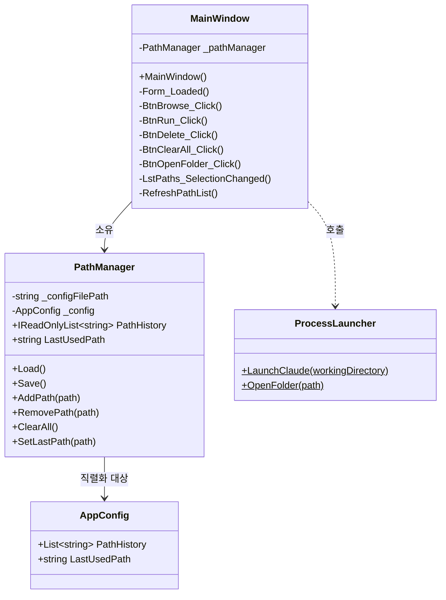
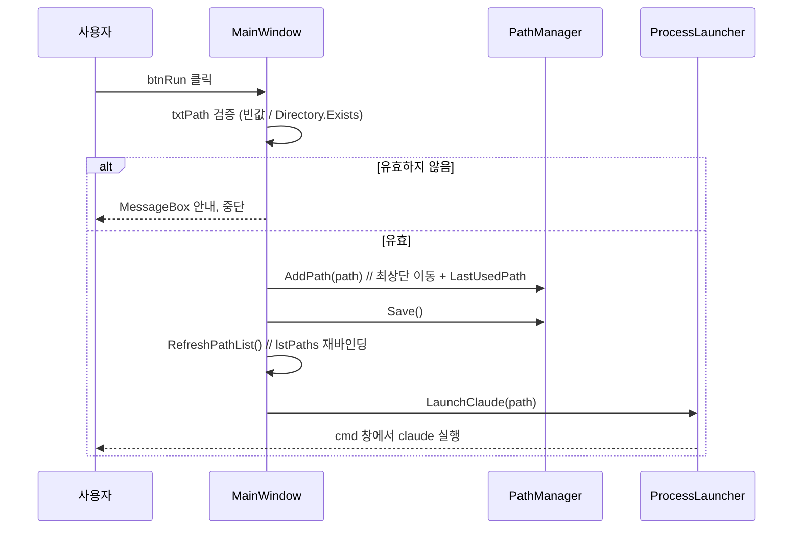

# ClaudeCodeHelper 설계서

## 개요
- **목적**: 프로젝트 폴더를 등록·선택해 해당 폴더에서 `claude` CLI를 실행하는 WPF 런처.
- **참조**: `Docs/DEVELOPMENT/Dev/Launcher/LAUNCHER_SPEC.md`
- **범위**: MainWindow XAML 레이아웃 + code-behind 이벤트 핸들러 + `PathManager` / `ProcessLauncher` / `AppConfig` 인터페이스.
- **벗어나는 범위**: MVVM/바인딩 추상화(1:1 복원이라 code-behind 직접 조작), 멀티 플랫폼.

## 제약 / 가정
- **제약**: Windows 전용(`net8.0-windows`, WPF). `System.Text.Json` 사용. 실행은 `cmd /k claude` 고정.
- **가정**: `claude`가 PATH에 등록돼 있어 `cmd`에서 호출 가능. config 파일은 실행 파일과 같은 폴더에 둔다.

## 아키텍처



**계층 책임**

| 타입 | 책임 |
|------|------|
| `MainWindow` | UI 표시 + 이벤트 핸들링. 검증 메시지(`MessageBox`)와 `lstPaths` 갱신 담당. |
| `PathManager` | config I/O + 경로 히스토리 상태(추가/삭제/최상단 이동/LastUsedPath). |
| `ProcessLauncher` | 외부 프로세스 실행만 (`cmd /k claude`, `explorer`). 정적 유틸. |
| `AppConfig` | JSON 직렬화 모델 (POCO). |

## XAML 레이아웃

```
┌─────────────────────────────────────────────────────┐
│ 경로: [txtPath............................] [찾아보기][실행] │  ← Row0 (Auto)
│ 저장된 경로 목록:                                       │  ← Row1 (Auto)
│ ┌───────────────────────────────┐ ┌──────────┐       │
│ │ lstPaths                       │ │ [삭제]    │       │  ← Row2 (*)
│ │  D:\GitPrjs\ClaudeCodeHelper   │ │ [전체삭제] │       │
│ │  D:\ClaudeEtc                  │ │ [폴더열기] │       │
│ │  ...                           │ │          │       │
│ └───────────────────────────────┘ └──────────┘       │
└─────────────────────────────────────────────────────┘
```

구조: 루트 `Grid`(3 Row) → Row0은 내부 `Grid`(Label / TextBox `*` / Browse / Run), Row2는 내부 `Grid`(2 Column: ListBox `*` / 버튼 `StackPanel`).

```xml
<Grid Margin="10">
    <Grid.RowDefinitions>
        <RowDefinition Height="Auto"/>   <!-- 경로 입력줄 -->
        <RowDefinition Height="Auto"/>   <!-- 목록 라벨 -->
        <RowDefinition Height="*"/>      <!-- 목록 + 버튼 -->
    </Grid.RowDefinitions>

    <!-- Row0: 경로 입력 -->
    <Grid Grid.Row="0">
        <Grid.ColumnDefinitions>
            <ColumnDefinition Width="Auto"/>
            <ColumnDefinition Width="*"/>
            <ColumnDefinition Width="Auto"/>
            <ColumnDefinition Width="Auto"/>
        </Grid.ColumnDefinitions>
        <TextBlock Grid.Column="0" Text="경로:" VerticalAlignment="Center" Margin="0,0,6,0"/>
        <TextBox   Grid.Column="1" x:Name="txtPath"/>
        <Button    Grid.Column="2" x:Name="btnBrowse" Content="찾아보기" Click="BtnBrowse_Click" Margin="6,0,0,0"/>
        <Button    Grid.Column="3" x:Name="btnRun"    Content="실행"     Click="BtnRun_Click"    Margin="6,0,0,0"/>
    </Grid>

    <!-- Row1: 라벨 -->
    <TextBlock Grid.Row="1" Text="저장된 경로 목록:" Margin="0,10,0,4"/>

    <!-- Row2: 목록 + 버튼 -->
    <Grid Grid.Row="2">
        <Grid.ColumnDefinitions>
            <ColumnDefinition Width="*"/>
            <ColumnDefinition Width="Auto"/>
        </Grid.ColumnDefinitions>
        <ListBox Grid.Column="0" x:Name="lstPaths" SelectionChanged="LstPaths_SelectionChanged"/>
        <StackPanel Grid.Column="1" Margin="6,0,0,0">
            <Button x:Name="btnDelete"   Content="삭제"     Click="BtnDelete_Click"   Margin="0,0,0,6"/>
            <Button x:Name="btnClearAll" Content="전체 삭제" Click="BtnClearAll_Click" Margin="0,0,0,6"/>
            <Button x:Name="btnOpenFolder" Content="폴더 열기" Click="BtnOpenFolder_Click"/>
        </StackPanel>
    </Grid>
</Grid>
```

> 원본은 WinForms `FolderBrowserDialog`였음. WPF에는 기본 폴더 다이얼로그가 없어 **.NET 8 내장 `Microsoft.Win32.OpenFolderDialog`** 사용(.NET 8부터 지원, 추가 패키지 불필요).

## 인터페이스 (구현 본문 없음)

```csharp
/// <summary>
/// config 파일(ClaudeCodeHelper.json)의 직렬화 모델.
/// </summary>
public class AppConfig
{
    /// <summary>등록된 경로 목록(최신이 앞).</summary>
    public List<string> PathHistory { get; set; } = new();

    /// <summary>마지막으로 실행한 경로.</summary>
    public string LastUsedPath { get; set; } = "";
}
```

```csharp
/// <summary>
/// 경로 히스토리 로드/저장 및 추가·삭제를 관리한다.
/// </summary>
public class PathManager
{
    /// <summary>config 파일 경로를 지정해 생성한다.</summary>
    /// <param name="configFilePath">ClaudeCodeHelper.json의 전체 경로</param>
    public PathManager(string configFilePath);

    /// <summary>현재 경로 목록(읽기 전용).</summary>
    public IReadOnlyList<string> PathHistory { get; }

    /// <summary>마지막 사용 경로.</summary>
    public string LastUsedPath { get; }

    /// <summary>config 파일을 읽어 상태를 채운다. 파일 부재/손상 시 빈 상태로 시작.</summary>
    public void Load();

    /// <summary>현재 상태를 config 파일에 저장한다.</summary>
    public void Save();

    /// <summary>경로를 목록 최상단에 추가(중복이면 위로 이동)하고 LastUsedPath로 설정한다.</summary>
    /// <param name="path">추가할 경로</param>
    public void AddPath(string path);

    /// <summary>지정 경로를 목록에서 제거한다.</summary>
    /// <param name="path">제거할 경로</param>
    public void RemovePath(string path);

    /// <summary>모든 경로를 제거한다.</summary>
    public void ClearAll();

    /// <summary>마지막 사용 경로를 설정한다.</summary>
    /// <param name="path">설정할 경로</param>
    public void SetLastPath(string path);
}
```

```csharp
/// <summary>
/// 외부 프로세스 실행 유틸리티.
/// </summary>
public static class ProcessLauncher
{
    /// <summary>지정 폴더에서 cmd.exe로 claude CLI를 실행한다(/k로 창 유지).</summary>
    /// <param name="workingDirectory">작업 디렉터리</param>
    public static void LaunchClaude(string workingDirectory);

    /// <summary>탐색기로 지정 폴더를 연다.</summary>
    /// <param name="path">열 폴더 경로</param>
    public static void OpenFolder(string path);
}
```

- **config 경로 결정**: `Path.Combine(AppContext.BaseDirectory, "ClaudeCodeHelper.json")`.
- **`LaunchClaude` 핵심**: `ProcessStartInfo { FileName="cmd.exe", Arguments="/k claude", WorkingDirectory=workingDirectory, UseShellExecute=true }` → `Process.Start`.

## 주요 흐름 — "실행" 클릭



기타 핸들러 요약:
- **BtnBrowse**: `OpenFolderDialog` → 선택 시 `txtPath`에 반영.
- **LstPaths_SelectionChanged**: 선택 항목 → `txtPath`에 반영.
- **BtnDelete**: 선택 없으면 안내 / 확인 후 `RemovePath` → `Save` → `RefreshPathList`.
- **BtnClearAll**: 확인 후 `ClearAll` → `Save` → `RefreshPathList`.
- **BtnOpenFolder**: 선택/입력 경로 검증 후 `OpenFolder`.

## 의존성
- **외부**: `System.Text.Json`(직렬화), `Microsoft.Win32.OpenFolderDialog`(폴더 선택) — 둘 다 .NET 8 기본 제공, NuGet 불필요.
- **내부**: `MainWindow` → `PathManager`, `ProcessLauncher`, `AppConfig`.

## 요구사항 충족 검증
> design 작성 시점 self-validation 마킹.
- [x] FR-1 경로 입력/선택 — `txtPath` + `BtnBrowse_Click`(OpenFolderDialog)
- [x] FR-2 Claude 실행 — `BtnRun_Click` → 검증 → `AddPath`/`Save` → `LaunchClaude`(cmd /k claude)
- [x] FR-3 목록 관리 — `lstPaths` + Delete/ClearAll/OpenFolder 핸들러
- [x] FR-4 설정 영속화 — `AppConfig` + `PathManager.Load/Save` + `System.Text.Json`, 빈 목록 시작
- [x] 비기능: 계층 분리(PathManager/ProcessLauncher), config 손상 시 빈 상태 시작(`Load` try/catch)

## 미해결 / 추후 결정 사항
1. **Window 제목** — 원본은 `ClaudeHelper`. 새 툴 이름 `ClaudeCodeHelper`로 바꿀지? (권장: `ClaudeCodeHelper`)
2. **`claude` 미설치/PATH 부재 시** — `cmd /k`라 창은 뜨고 "claude: 명령을 찾을 수 없음"이 표시됨. 별도 사전 검증 없이 원본대로 둘지? (1:1 복원이면 그대로 둠 — 권장)

## 다음 단계 (사용자 결정)
- **실행 순서 도출**: `/hs:workflow`
- **바로 구현**: `/hs:implement` — 규모가 작아 설계→구현 직행 적합
